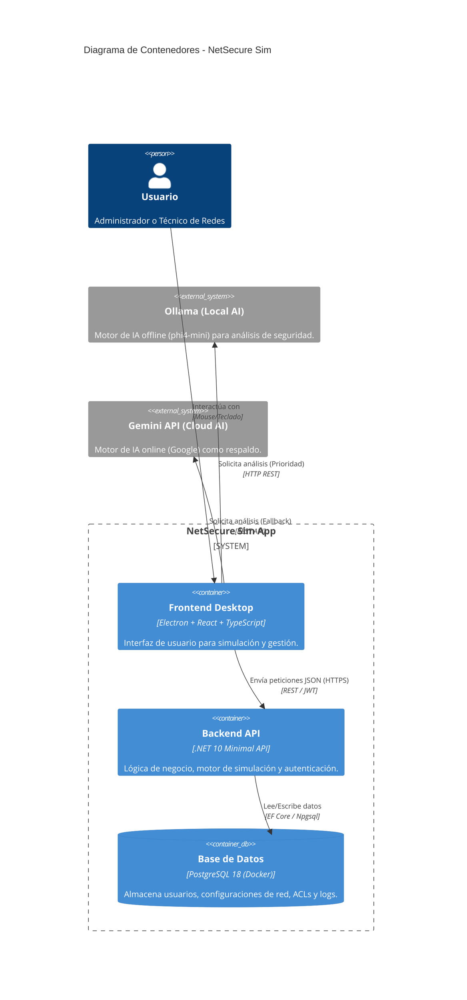
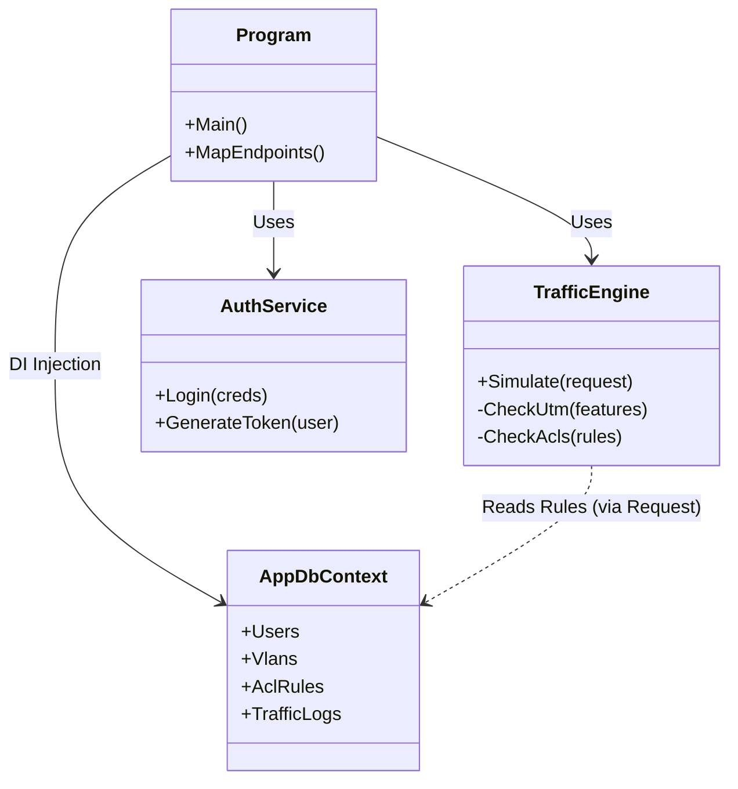

# Arquitectura del Sistema - NetSecure Sim

## 1. Diagrama de Arquitectura (C4 - Nivel Contenedor)

## 2. Diagrama de Componentes del Backend

## 3. Tecnologías Clave

### Frontend (Client-Side)
- **Framework**: React 19 con Vite.
- **Empaquetado**: Electron (para experiencia desktop nativa).
- **Estilos**: Tailwind CSS con diseño "Glassmorphism" y modo oscuro.
- **Internacionalización**: i18next (Español/Inglés).

### Backend (Server-Side)
- **Runtime**: .NET 10 (Preview/RC).
- **Arquitectura**: Minimal APIs (ligero y rápido).
- **ORM**: Entity Framework Core.
- **Seguridad**: JWT (JSON Web Tokens) con BCrypt para hashing.

### Infraestructura
- **Contenedores**: Docker Compose para orquestar la base de datos PostgreSQL.
- **IA**: Arquitectura híbrida (Local-First con Ollama, Cloud-Fallback con Gemini).
