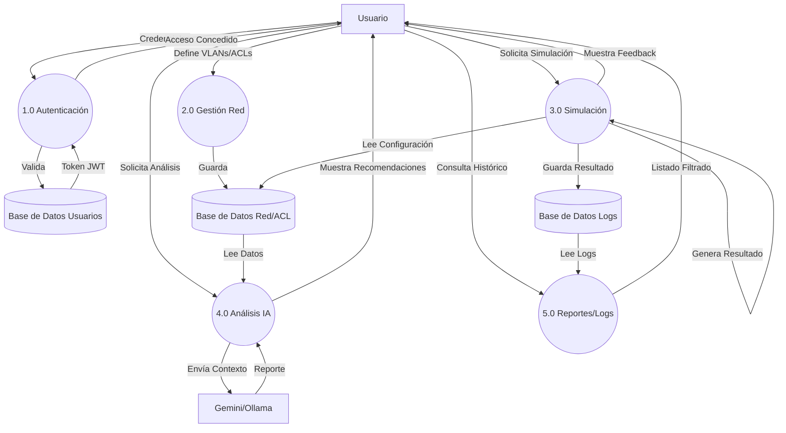

# Diagramas de Flujo de Datos (DFD) - NetSecure Sim

## 1. DFD Nivel 0 (Diagrama de Contexto)

Representa la interacción del sistema completo con entidades externas.

```mermaid
graph TD
    User[Usuario (Admin/Técnico)]
    System((NetSecure Sim))
    AI_Engine[Motor IA Ext.]
    
    User -- "Credenciales, Configuración, Comandos" --> System
    System -- "Logs, Reportes, Estado Visual" --> User
    
    System -- "Contexto de Red (JSOSON)" --> AI_Engine
    AI_Engine -- "Análisis de Vulnerabilidades" --> System
```

## 2. DFD Nivel 1 (Diagrama de Nivel Superior)

Desglosa el sistema en sus principales subsistemas funcionales.



## 3. Descripción de Procesos

### 1.0 Gestión de Autenticación
Recibe credenciales, verifica contra la base de datos de usuarios (con contraseñas hasheadas) y emite un token JWT que habilita el acceso a los demás procesos según el rol.

### 2.0 Gestión de Configuración de Red
Permite al Administrador definir la topología (VLANs, Dispositivos) y las reglas de seguridad (ACLs). Estos datos son persistentes y críticos para la simulación.

### 3.0 Motor de Simulación
El núcleo del sistema. Toma un paquete simulado (Origen, Destino, Protocolo), atraviesa la lógica de ruteo y firewall definida en la configuración, aplica reglas UTM probabilísticas, y determina si el tráfico pasa o se bloquea.

### 4.0 Análisis con IA
Extrae la configuración actual en formato JSON y la envía a un LLM (Modelo de Lenguaje) para que identifique posibles conflictos, brechas de seguridad o mejoras de optimización en las ACLs.

### 5.0 Gestión de Logs
Almacena cada evento de simulación para auditoría futura, permitiendo revisar qué tráfico fue permitido o bloqueado históricamente.
